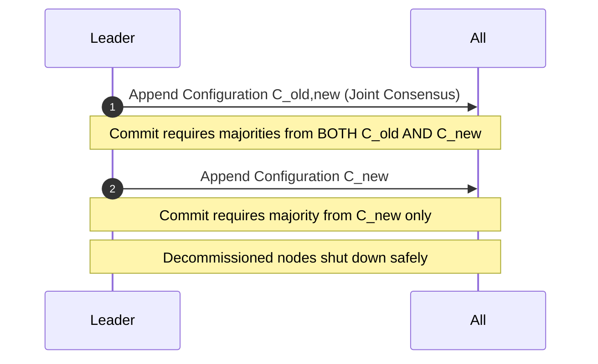

# Raft Dynamic Membership Changes & Joint Consensus

Safe cluster membership reconfiguration ($C_{	ext{old}} 	o C_{	ext{new}}$) without risk of split-brain quorums.

```mermaid
sequenceDiagram
    autonumber
    Leader->>All: Append Configuration C_old,new (Joint Consensus)
    Note over Leader,All: Commit requires majorities from BOTH C_old AND C_new
    Leader->>All: Append Configuration C_new
    Note over Leader,All: Commit requires majority from C_new only
    Note over Leader,All: Decommissioned nodes shut down safely
```
