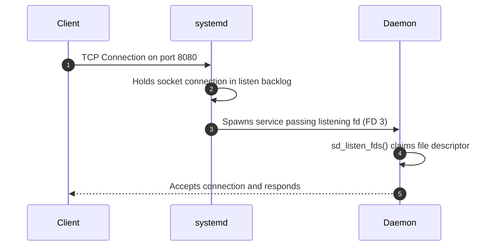

# systemd Socket Activation Architecture

Allows daemons to start on-demand upon the arrival of the first TCP/UNIX socket connection.

```mermaid
sequenceDiagram
    autonumber
    Client->>systemd: TCP Connection on port 8080
    systemd->>systemd: Holds socket connection in listen backlog
    systemd->>Daemon: Spawns service passing listening fd (FD 3)
    Daemon->>Daemon: sd_listen_fds() claims file descriptor
    Daemon-->>Client: Accepts connection and responds
```
