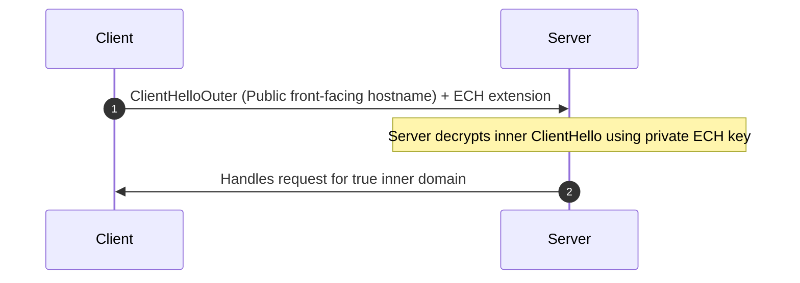

# TLS Encrypted Client Hello (ECH) Architecture

Encrypts the Server Name Indication (SNI) extension to prevent on-path ISPs and firewalls from inspecting visited hostnames.

```mermaid
sequenceDiagram
    autonumber
    Client->>Server: ClientHelloOuter (Public front-facing hostname) + ECH extension
    Note over Server: Server decrypts inner ClientHello using private ECH key
    Server->>Client: Handles request for true inner domain
```
